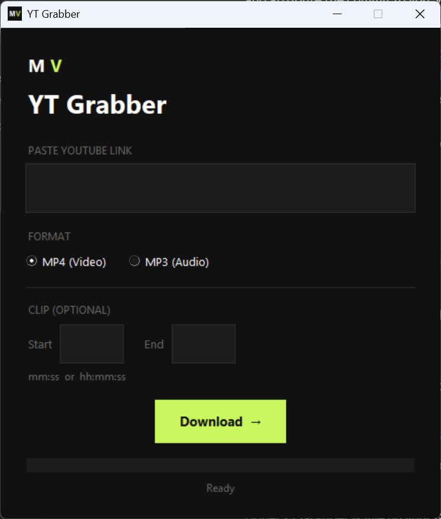

# YT Grabber

A clean, minimal desktop app for downloading YouTube videos as **MP4** or **MP3** — with a built-in **clip trimmer** so you can grab just the section you need.

<br clear="left" />

Built it to speed up sourcing footage for short-form video edits: paste a link, optionally set a start/end time, and get a ready-to-use file.

**[⬇ Download the latest release](https://github.com/cainehoratio/yt-grabber/releases/latest)** — grab `YT Grabber.exe`, double-click, done. No install needed.



## Features

- **MP4 (video) or MP3 (audio)** download with a single click
- **Auto-fetches video length** when you paste a link
- **Clip trimming** — set a start and end time to download just a slice
- **Live status** through every step (downloading, merging, trimming)
- Highest available quality by default
- Dark, minimal UI

## Tech

- **Python** + **tkinter** for the GUI
- **[yt-dlp](https://github.com/yt-dlp/yt-dlp)** for downloading
- **FFmpeg** for merging streams and trimming clips

## Setup

**Requirements:** Python 3.10+ and [FFmpeg](https://ffmpeg.org/download.html) on your PATH.

```bash
# 1. Install dependencies
pip install -r requirements.txt

# 2. Install FFmpeg (Windows, via winget)
winget install Gyan.FFmpeg

# 3. Run the app
python app.py
```

Downloads are saved to a `downloads/` folder next to the app.

### Command-line version

A minimal CLI is also included:

```bash
python download.py <youtube_url> [mp3|mp4]
```

## Notes

- Clip trimming re-encodes the selected range for frame-accurate, perfectly in-sync output.
- For personal use — please respect YouTube's Terms of Service and creators' copyright.

---

Made by [Máté Vörös](https://www.metavoros.com)
